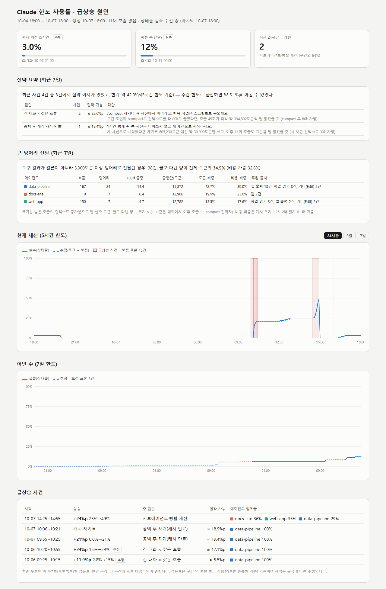
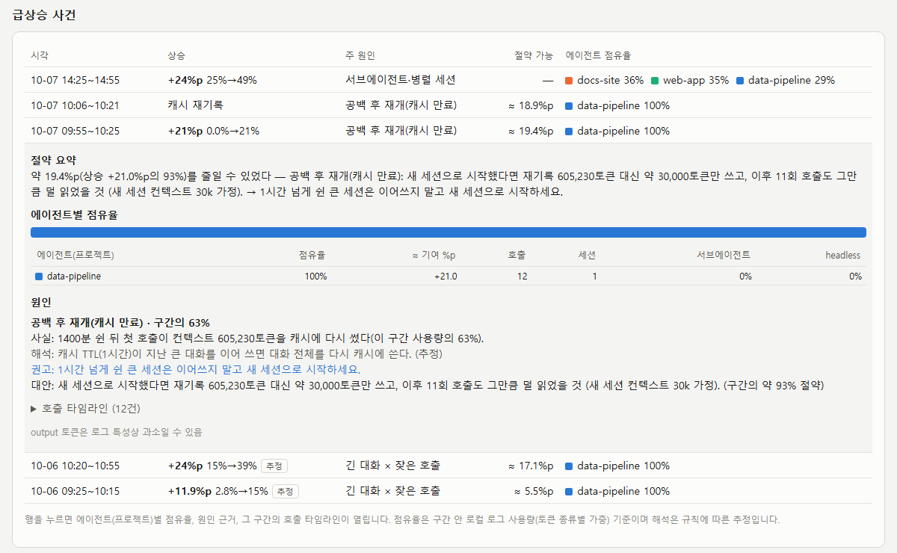

# moni_token

**English** · [한국어](README.ko.md)

> "I only did a little work, so why did 5% of my Claude limit disappear in 50 minutes?"

moni_token reads Claude Code's local logs and answers that question. When your limit usage jumps, it tells you
**which session** caused it, **which pattern** was behind it (a long conversation calling tools over and over, a big
session resumed after a long break, several sessions running in parallel, …) and **how much you could have saved**
by doing it differently.

- **No LLM calls.** A tool meant to save tokens should not spend them. Every judgement is a fixed rule, and every
  sentence comes from a template.
- **Nothing leaves your PC.** No network access. The dashboard is a single static HTML file.
- **No conversation text is stored.** Only numbers (tokens, times, call counts) and metadata (session id, project
  folder name, model, tool names, sizes).
- **Logs are read-only.** It never changes or deletes Claude Code's files.



<sub>Screenshot from synthetic demo data (`scripts/demo_report.py`). The dashboard UI is currently in Korean.</sub>

## What it shows

| Section | What you learn |
|---|---|
| Tiles at the top | Current 5-hour and weekly limit usage in %, when they reset, and spikes in the last 24 hours |
| Savings summary | How many %p you could have saved this week, per cause, with the alternative (e.g. "start a new session") |
| Large chunks | How often raw tool output (whole files, long command output) was sent instead of a conclusion, and what carrying it in the context cost, per project |
| Limit charts | Limit % over time. Solid line = measured (from Claude Code's status line), dashed line = estimated from the logs. Red bands are spikes |
| Spike list | Each spike with its cause. Click a row for the per-project share, the evidence numbers and a timeline of the calls |



### Causes it recognises

| Cause | How it is detected | Typical advice |
|---|---|---|
| Long conversation × many calls | Each call re-reads a large cached context, and there are many calls in the window | `/compact`, or continue in a new session; bundle repetitive steps into a script |
| Resumed after idle (cache expired) | The first call after a gap longer than the cache TTL writes the whole context to the cache again | Don't resume a large session after a long break; start a new one |
| Parallel sessions / subagents | Several sessions or sidechains are active in the same window | Run fewer at once, or one after another |
| Cache miss | Cache writes surge in the middle of a session | Avoid switching model or settings mid-task |
| Large input | Context jumps right after reading an image or a big file | Read only the part you need; pass raw content as a file |
| Web research | Many WebSearch / WebFetch calls | Narrow the research and keep only summaries |
| Output burst | Output tokens take an unusual share | Have long results written to a file; limit output length |

The cause and its numbers are facts from the logs; the interpretation is labelled as an estimate.

## How it differs from existing tools

| Tool | What it does well | What moni_token adds |
|---|---|---|
| [ccusage](https://github.com/ryoppippi/ccusage) | Token and cost totals per day, session and 5-hour block | Explains *why* a period was expensive and records it as an incident |
| [Claude Code Usage Monitor](https://github.com/Maciek-roboblog/Claude-Code-Usage-Monitor) | Live terminal dashboard, burn rate, limit predictions | Attributes a spike to a session and a pattern, with a counterfactual saving |
| ccflare | Local web UI with token, cost and speed charts | Incident list with causes and per-call timelines |

moni_token does not try to replace these tools. Use ccusage for totals; use moni_token when a number surprises you.

## Install

Requirements: Python 3.12+ and [uv](https://docs.astral.sh/uv/). Developed and used on Windows 10/11. The code has
macOS (`osascript`) and Linux (`notify-send`) notification paths, but they are untested; the setup commands below are
for Windows.

```powershell
git clone https://github.com/reddol18/moni_token.git
cd moni_token
uv sync
uv run moni-token collect     # first run reads all existing logs into ~/.moni_token/usage.db
uv run moni-token report      # writes ~/.moni_token/report.html
start $HOME\.moni_token\report.html
```

That's it for a one-off look. The steps below make it run on its own.

### 1. Refresh every 2 minutes (recommended)

`check` collects new log lines, shows a desktop notification for a new spike and rewrites the report. It takes
well under a second. On Windows, register it with Task Scheduler (run from the repo folder):

```powershell
$py = (Resolve-Path .venv\Scripts\pythonw.exe).Path
$action = New-ScheduledTaskAction -Execute $py -Argument "-m moni_token.cli check"
$trigger = New-ScheduledTaskTrigger -Once -At (Get-Date) -RepetitionInterval (New-TimeSpan -Minutes 2)
Register-ScheduledTask -TaskName "moni_token check" -Action $action -Trigger $trigger
```

To remove it: `schtasks /Delete /TN "moni_token check" /F`

### 2. Status line recorder (recommended)

Claude Code passes the real limit % to the status line command. moni_token records just those numbers, which gives
the solid "measured" line and calibrates the estimate automatically. Add this to `~/.claude/settings.json`:

```json
"statusLine": {
  "type": "command",
  "command": "C:\\path\\to\\moni_token\\.venv\\Scripts\\moni-token-statusline.exe"
}
```

The status line then shows something like `5h 12% ~15:06 · ctx 40%`. If you already have a status line command,
keep it and wrap it: `moni-token-statusline.exe --wrap "<your old command>"`.
It starts recording from the next new Claude Code session.

### 3. Without the status line: enter `/usage` by hand

Type `/usage` in Claude Code and copy the numbers:

```powershell
uv run moni-token observe --session 49 --session-reset "2026-10-07 02:30" --week 7 --week-reset "2026-10-13 18:00"
```

One reading is enough to draw the estimate. More readings make it more accurate.

## Commands

| Command | What it does |
|---|---|
| `collect` | Read new log lines (incremental; only the new part of each file) |
| `check` | `collect` + notification for new spikes + report refresh (for the scheduled task) |
| `report [--days 7]` | Write the HTML dashboard |
| `status` | Current 5-hour window, speed and projection |
| `events` | Recorded spikes with their savings sentence |
| `savings` | What could have been saved this week, by cause |
| `analyze --from "2026-10-06 12:31" --to "2026-10-06 12:56"` | Explain any window you choose (`--save` records it) |
| `chunks` | Raw chunks sent to the API, per project |
| `daily` / `blocks` | Token totals per day / 5-hour windows |
| `observe` / `calibrate` | Enter limit % you saw, for calibration |
| `spikes`, `backfill-events`, `suggest-floor` | Detection details and tuning |

Run any of them as `uv run moni-token <command>`.

### Settings

Detection thresholds live in `~/.moni_token/config.toml` (all optional):

```toml
[spike]
pct_jump = 3.0          # 5-hour limit rising this many %p within window_min is a spike
window_min = 15
realert_min = 30        # no repeat notification within this many minutes
single_call_cache_write_tokens = 200000   # one call re-caching this much is a spike by itself
```

## Try it without your own data

```powershell
uv run python scripts/demo_report.py demo
start demo\report.html
```

This writes fake logs with all the patterns above and builds a report from them. The screenshots in this README come
from it.

## Limitations

- **Limit % is the account's value; the logs only cover this PC.** claude.ai web chats, cloud sessions and other PCs
  use the same limit but are invisible here, so estimates (the dashed line) can be lower than reality. Measured values
  from the status line are exact.
- **Output tokens may be undercounted.** Claude Code logs can record a partial `output_tokens` value. moni_token takes
  the maximum across the lines of one response, but the true value can still be higher. See
  https://github.com/anthropics/claude-code/issues/22671.
- Usage is weighted with a bundled list-price table (`src/moni_token/pricing.toml`). Prices marked
  `verified = false` are estimates. The table only sets the relative weight of token types; the % comes from
  calibration.
- Causes are rule-based. A window that fits no rule is shown as "no matching cause".
- The Claude Code log format is not a public API and may change between versions.

## Development

```powershell
uv run pytest
```

Design notes are in `docs/adr/`. A test checks that the package never imports an LLM client.

## License

MIT — see [LICENSE](LICENSE).
